# Single-Page DocVQA: Multimodal Retrieval-Augmented Generation

This project implements a novel **Multimodal Retrieval-Augmented Generation (RAG)** pipeline for the Single-Page Document Visual Question Answering (DocVQA) task. Our approach leverages a **Multimodal Bi-Encoder** (trained via unsupervised contrastive learning) and **Cross-Encoder Re-ranking** to retrieve similar training examples, which are then used to build structured **Chain-of-Thought (CoT)** prompts for a Multimodal Large Language Model (MLLM).

## Architecture

The system consists of five key stages:
1.  **Multimodal Classifier:** Categorizes the document/question type (e.g., table, form, handwritten) using a CLIP-based classifier.
2.  **Caption Generation:** Generates a dense textual description of the document image using a Vision-Language Model (VLM).
3.  **Multimodal Retrieval:** Retrieves the top-k most similar examples from the training set using a **Bi-Encoder** (CLIP+SentenceTransformer) for fast retrieval and a **Cross-Encoder** (BLIP-2) for precise re-ranking.
4.  **CoT Prompt Builder:** Constructs a few-shot prompt that includes the retrieved examples, their ground-truth answers, and synthetic **Chain-of-Thought reasoning steps**.
5.  **MLLM Inference:** Generates the final answer using a Multimodal LLM (e.g., Qwen2-VL), guided by the retrieved context.

```mermaid
graph LR
    InputRequest("User Request<br>(Image + Question)") --> Classifier("Stage 1: CLIP Classifier")
    InputRequest --> CaptionGen("Stage 2: VLM Caption Gen")

    Classifier -->|"Predicted Type"| QueryContext("Enriched Query")
    CaptionGen -->|"Dense Caption"| QueryContext

    QueryContext --> BiEncoder("Stage 3: Bi-Encoder<br>(CLIP + FAISS)")
    BiEncoder -->|"Top-K Candidates"| CrossEncoder("Stage 3: Cross-Encoder<br>(BLIP-2 ITM)")
    
    CrossEncoder -->|"Top-N Context"| PromptBuilder("Stage 4: CoT Prompt Builder")
    QueryContext --> PromptBuilder

    PromptBuilder --> FinalPrompt("Structured CoT Prompt")
    FinalPrompt --> MLLM("Stage 5: Multimodal LLM")
    MLLM --> Output("Final Answer")
```



## Installation

1.  **Clone the repository:**
    ```bash
    git clone https://github.com/fisherman611/single-page-docvqa.git
    cd single-page-docvqa
    ```

2.  **Install dependencies:**
    ```bash
    pip install -r requirements.txt
    ```

3.  **Checkpoints Setup:**
    Ensure you have the trained model checkpoints in the following structure:
    ```
    checkpoints/
    ├── clip_classifier/
    │   └── last_model.pt
    multimodal_biencoder_checkpoints/
    │   ├── best_model.pt
    │   └── index_epochXX
    multimodal_crossencoder_checkpoints/
    │   └── best_model.pt
    ```

## Usage

### Running the Pipeline Demo
You can run the end-to-end pipeline using the provided script:

```bash
python models/multimodal_retriever/pipeline.py
```

This will run a demo inference on a sample image using the configured checkpoints.
